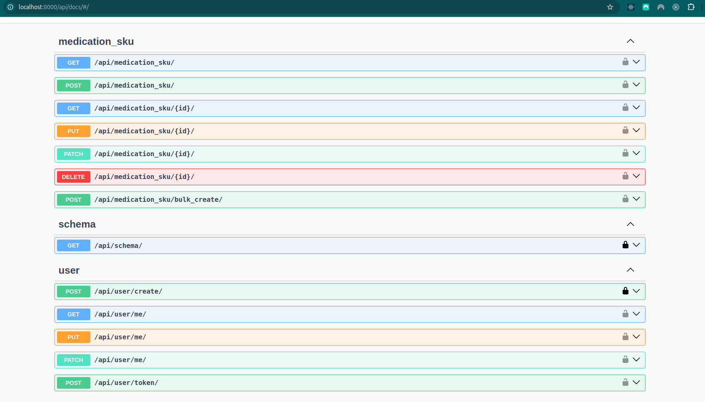

# Medication SKU API

A RESTful API to manage medication SKUs, allowing users to perform CRUD operations and bulk-upload medication SKUs to the catalogue. This project meets the requirements to manage medication SKUs via APIs and supports authentication, user-specific data, and bulk operations.

## Features

- **CRUD Operations**: 
  - Create, Read, Update, and Delete individual medication SKU through dedicated APIs.
- **Bulk Create**: 
  - A dedicated API to bulk create multiple medication SKUs.
- **User Authentication**: 
  - Users must be authenticated to interact with the API.
- **Role-based Access Control**: 
  - Only authenticated users can partial/full update and delete the medication SKUs.
- **API Documentation**: 
  - Detailed descriptions of each API endpoint.

## 🚀 Tech Stack
- **🌐 Django**: A high-level web framework for rapid and secure development.
- **📖 Django REST Framework (DRF)**: Toolkit for building robust and scalable Web APIs.
- **✨ DRF-Spectacular**: A customizable OpenAPI 3.0 generator for DRF.
- **🐘 PostgreSQL**: A powerful open-source database used to store medication SKUs.
- **🔒 Django Authentication**: Provides token-based authentication for user access.
- **🐳 Docker**: A platform for developing, shipping, and running applications in containers.

## Prerequisites

Make sure you have the following installed:

- Docker: [Install Docker](https://docs.docker.com/engine/install/)

## Setup & Installation

Follow these steps to set up and run the project locally:

### 1. Clone the Repository

```bash
# SSH
git clone git@github.com:ZhitingLu/medication_sku.git
cd medication-sku
```

### 2. Environment Setup (Optional, you can run the Docker container without this step)
Create a .env file in the root directory and provide the necessary environment variables:


```bash
# .env
DEBUG=True
SECRET_KEY=your-secret-key
DB_HOST=db
DB_PORT=5432
DB_NAME=medication_sku_db
DB_USER=your-db-user
DB_PASSWORD=your-db-password
```
### 3. Build and Run the Application with Docker
Step 1: Build the Docker Container

```bash
# bash
docker compose build
```

Step 2: Start the Application

```bash
# bash
docker compose up
```

### 4. Apply Migrations
After starting the application, open another terminal and run:

```bash
# bash
docker compose run --rm app sh -c "python manage.py migrate"
```

### 5. Access the Application
API: The application will be available at http://localhost:8000/.
Admin Panel: Visit http://localhost:8000/admin/ to access the admin panel.

### 🧪 Running Tests
Run the following command to execute tests:

```bash
# bash
docker compose run --rm app sh -c "python manage.py test && flake8"
```

### 📂 Folder Structure
```
.
├── .github/               # GitHub Actions
│   ├── workflows/         # Workflows
├── app/                   # Main Django application code
│   ├── app/               # Main app for configurations and settings
│   ├── core/              # Core app containing foundational models
│   ├── user/              # Custom user management app
│   ├── medication_sku/    # Medication SKU API app
├── docker-compose.yml     # Docker Compose configuration
├── Dockerfile             # Docker build instructions
├── requirements.txt       # Production dependencies
├── requirements.dev.txt   # Development dependencies
```

### 📖 API Documentation
API documentation is automatically generated using DRF-Spectacular. After running the application, visit:

Swagger UI: http://localhost:8000/api/docs/
Download schema: http://localhost:8000/api/schema/



### 🔧 Common Commands
- Run Migrations: 
```
docker compose run --rm app sh -c "python manage.py migrate"
```
- Create Superuser: 
```
docker compose run --rm app sh -c "python manage.py createsuperuser"
```
- Install New Dependencies: Add them to requirements.txt and rebuild the container:
```
docker compose build
```
